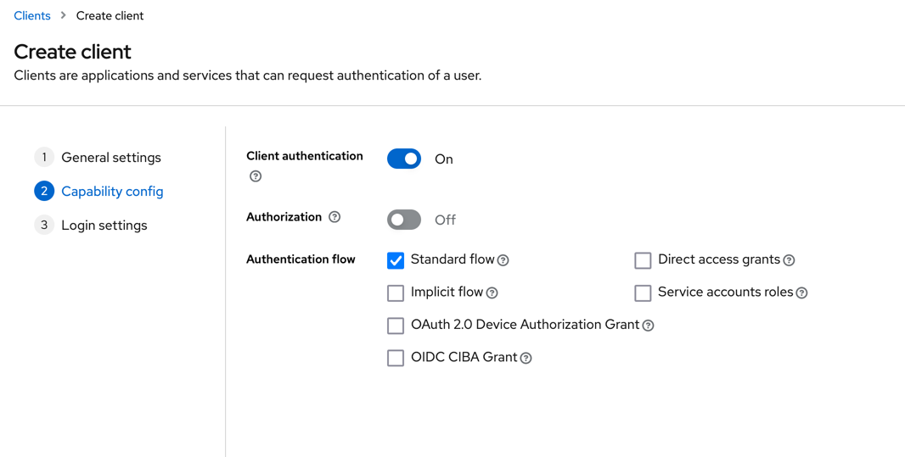

# Setup

1. Create a realm in keycloak\
   

2. Go to the newly created realm and create a client\
   

3. Turn on client authentication (use client secret) and select standard flow (we will be using auth code flow in this
   demo)\
   

4. Set the valid redirect uri that point to your spring resource server (keycloak support wildcard for the uris, but it
   is not a good practice. It is used here just for simplicity. Use exact uri instead in real world application)
   

5. (Optional - PKCE) To turn on PKCE. Go to the advanced setting in the client you just created and find the PKCE option
   and select S256.
   
   

6. (Optional - external id provider) To use external idp, go to the id providers tab and add a provider (Google will be
   used for this demo. Go to Google Cloud Console and create a project, then go to APIs & Service > Credentials to make
   a client credential (id and secret)
   
   
   
   

7. The code for the resource server is already provided in this demo, you can just run it directly (remember to also
   turn on keycloak)

# Usage

1. A TestAuthController with a /test endpoint is created with jwt authorization. What you need to do now is obtain a jwt
   to use the api.

2. Go to keycloak with url \
   http:
   //{kc-url}/realms/{your-realm}/protocol/openid-connect/auth?response_type=code&client_id={client-id}&scope=openid&state={state}&redirect_uri={uri-that-handle-the-auth-code-should-be-deep-link-in-mobile}&nonce={nonce}&code_challenge_method=S256&code_challenge={code_challenge} \
   code_challenge is optional (it is used for PKCE).
   A sample url would
   be http://localhost:8088/realms/myrealm/protocol/openid-connect/auth?response_type=code&client_id=myclient&scope=openid&state=9fVjCdAQr-V9OGFg-xb8zpXI4j_J_KFYkak5l6NfIDk%3D&redirect_uri=http://localhost:8080/login/oauth2/code/keycloak&nonce=cwj2qIUsitxFrcDF-3mIzR6QQpfBFu_he2ty4SbbOLI&code_challenge_method=S256&code_challenge=AOV-5oVOygC2JnN1cl0D8g74i4qSjsKbmLnW2EXhguQ
   

3. For simplicity, we didn't make a endpoint to handle the auth code but handle it manually. (We can simply use browser
   dev tool to see the traffic to obtain the auth code)
   

4. We can then go to the token endpoint of keycloak to do the token exchange. (http:
   //{keycloak-url}/realms/{your-realm}/protocol/openid-connect/token)\
   code_verifier is required if you turned on PKCE. The redirect uri need to match the uri you set in step 2.

5. Copy the access token to the bearer token header and it is done.
   
